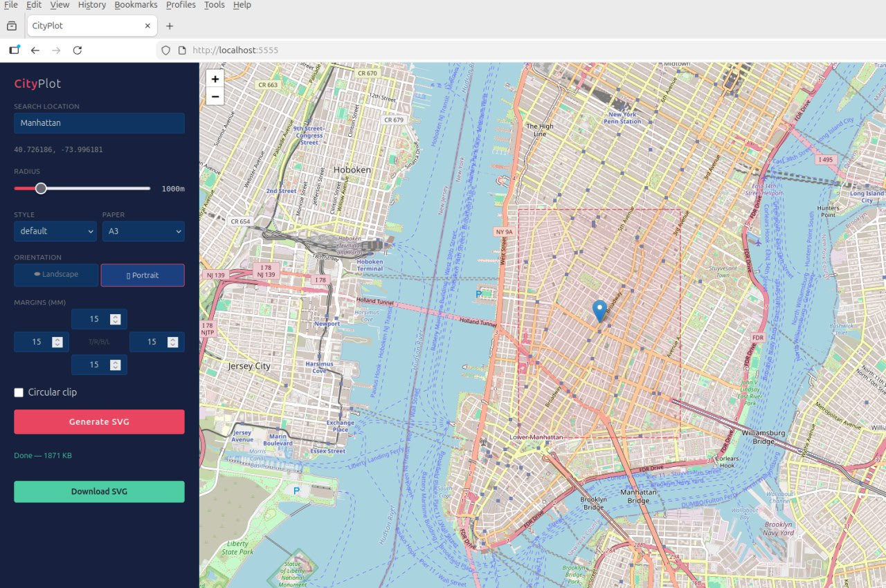

# CityPlot

Generate plotter-ready SVGs from OpenStreetMap data. No rasterization, no pixel-to-vector conversion — pure vector from source to output.

## How It Works

CityPlot fetches geographic data (streets, buildings, water, parks, railways) from OpenStreetMap via the Overpass API, projects it to metric coordinates (UTM), and writes SVG paths directly. Every street, building outline, waterway, and park boundary becomes a native vector path — no pixels involved at any stage.

The output is **layered**: each feature type lives in its own SVG group (`<g id="layer_name">`). This enables multi-color plotting — pause the plotter, swap the pen, resume on the next layer.

All geometries are **clipped** to the selected area (rectangular or circular) at the geometry level using Shapely, ensuring clean edges and no invisible paths outside the canvas.

## Web UI

CityPlot includes a browser-based interface with an interactive map.



```bash
python web.py
# → http://localhost:5555
```

**Features:**
- **Interactive map** — click to set center, or search by address/place name (Nominatim)
- **Live preview** — radius overlay (rectangle or circle) updates in real-time on the map
- **All parameters** — style, paper size, orientation (landscape/portrait), margins (per side), circular clip
- **One-click generate** — SVG is rendered server-side, then downloaded directly

## CLI

```bash
# City center, 2km radius, default style
python cityplot.py "Bremen, Germany" --radius 2000 --output bremen.svg

# GPS coordinates as center point
python cityplot.py "53.0758,8.8072" --radius 1.5k --output bremen.svg

# Bounding box (west,south,east,north)
python cityplot.py --bbox 8.78,53.06,8.84,53.09 --output bremen-center.svg

# Minimal style, A4 portrait
python cityplot.py "London, UK" --radius 3000 --style minimal --paper a4 --output london.svg

# Circular clip mask
python cityplot.py "Paris, France" --radius 1500 --circle --output paris.svg

# Custom margins (top,right,bottom,left) — leave space for text at bottom
python cityplot.py "Münster, Germany" --radius 1000 --margin 15,15,40,15 --output muenster.svg
```

## Installation

```bash
git clone https://github.com/wintermuteHB/CityPlot.git
cd CityPlot
python -m venv .venv
source .venv/bin/activate
pip install -r requirements.txt
```

## Styles

| Style | Description | Layers |
|---|---|---|
| `default` | Full map with colors — water (blue fill), parks (green fill), buildings (gray) | 7 layers |
| `minimal` | Streets + water only, black strokes | 4 layers |
| `buildings` | Building footprints with major streets and water | 3 layers |
| `mono` | All layers in black/gray (single-pen plotting) | 7 layers |

Water and park areas are rendered with a light fill color and thin stroke in `default` and `mono` styles — they appear as filled regions, not just outlines.

```bash
python cityplot.py --list-styles
```

## Options

| Flag | Default | Description |
|---|---|---|
| `place` | — | Place name (`"Bremen, Germany"`) or GPS coords (`"53.07,8.82"`) |
| `--bbox` | — | Bounding box: `west,south,east,north` |
| `--radius` | `2000` | Radius in meters (`2000`) or km (`1.5k`, `1.5km`) |
| `--style` | `default` | Visual style preset |
| `--paper` | `a3l` | Paper size: `a4`, `a4l`, `a3`, `a3l`, `letter` |
| `--margin` | `15` | Margins in mm: `all`, `V,H`, or `top,right,bottom,left` |
| `--circle` | off | Circular clip instead of rectangular |
| `-o` / `--output` | `output.svg` | Output file path |

**Paper sizes** — append `l` for landscape:
- `a4` (210×297mm), `a4l` (297×210mm)
- `a3` (297×420mm), `a3l` (420×297mm)  
- `letter` (216×279mm)

SVG units are millimeters — output is 1:1 for plotter software.

**Center point** — three ways to specify:
1. Place name: `"Bremen, Germany"` (geocoded via OSM/Nominatim)
2. GPS coordinates: `"53.0758,8.8072"` (lat,lon)
3. Bounding box: `--bbox 8.78,53.06,8.84,53.09` (west,south,east,north)

**Margins** — CSS shorthand syntax:
- `--margin 15` → 15mm all sides
- `--margin 15,20` → 15mm top/bottom, 20mm left/right
- `--margin 15,15,40,15` → top 15, right 15, bottom 40, left 15

## Architecture

```
                    ┌──────────────┐
                    │  Overpass API │
                    └──────┬───────┘
                           │ GeoJSON
                    ┌──────▼───────┐
                    │    osmnx     │
                    │  + geopandas │
                    └──────┬───────┘
                           │ UTM-projected GeoDataFrames
                    ┌──────▼───────┐
                    │   Shapely    │
                    │  clip to     │
                    │  rect/circle │
                    └──────┬───────┘
                           │ Clipped geometries
                    ┌──────▼───────┐
                    │   svgwrite   │
                    │  layered SVG │
                    │  (mm units)  │
                    └──────────────┘
```

No raster step. No intermediate PNG. Geographic coordinates are projected to metric space (UTM), clipped to the target area, then mapped directly to SVG canvas coordinates with correct aspect ratio and margins.

## Dependencies

- [osmnx](https://github.com/gboeing/osmnx) — OpenStreetMap data via Overpass API
- [geopandas](https://geopandas.org/) — geospatial data processing
- [svgwrite](https://github.com/mozman/svgwrite) — SVG generation
- [shapely](https://shapely.readthedocs.io/) — geometry operations (clipping)
- [flask](https://flask.palletsprojects.com/) — web UI (optional, only for `web.py`)

## License

Copyright © 2026 Uwe Trostheide

Licensed under the [GNU Affero General Public License v3.0](LICENSE).
